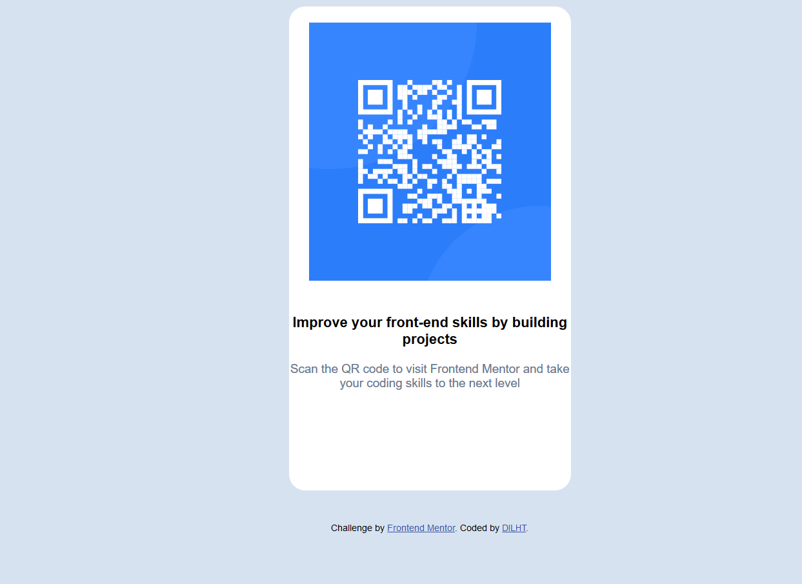

# Frontend Mentor - QR code component solution

This is a solution to the [QR code component challenge on Frontend Mentor](https://www.frontendmentor.io/challenges/qr-code-component-iux_sIO_H). Frontend Mentor challenges help you improve your coding skills by building realistic projects. 

## Table of contents

- [Overview](#overview)
  - [Screenshot](#screenshot)
  - [Links](#links)
  - [Built with](#built-with)
  - [What I learned](#what-i-learned)
  - [Continued development](#continued-development)
  - [Useful resources](#useful-resources)
- [Author](#author)
- [Acknowledgments](#acknowledgments)

**Note: Delete this note and update the table of contents based on what sections you keep.**

## Overview
i used HTML and CSS to build the QR code componet challenge
### Screenshot

 
 
 
### Links

- Solution URL: https://dilhtqrcode.netlify.app/
- Live Site URL: [Add live site URL here](https://your-live-site-url.com)

## My process

### Built with

- Semantic HTML5 markup
- CSS custom properties
- Flexbox

 
### What I learned

 i have learned how to deploy and flexbox 

**Note: Delete this note and the content within this section and replace with your own learnings.**

### Continued development

 i want to focus on good design and using simple code to achieve them same effect

**Note: Delete this note and the content within this section and replace with your own plans for continued development.**

### Useful resources
https://web.dev/learn/html

**Note: Delete this note and replace the list above with resources that helped you during the challenge. These could come in handy for anyone viewing your solution or for yourself when you look back on this project in the future.**

## Author

- Website - Daniel Kasambala (https://dilhtqrcode.netlify.app/)
- Frontend Mentor - [@DILHT](https://www.frontendmentor.io/profile/DILHT)

 
## Acknowledgments

##

**Note: Delete this note and edit this section's content as necessary. If you completed this challenge by yourself, feel free to delete this section entirely.**
